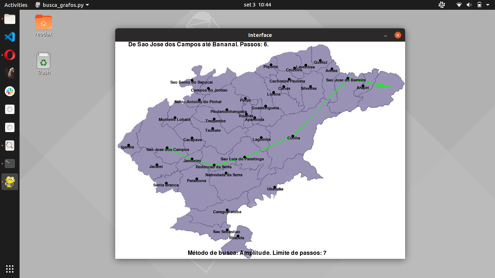
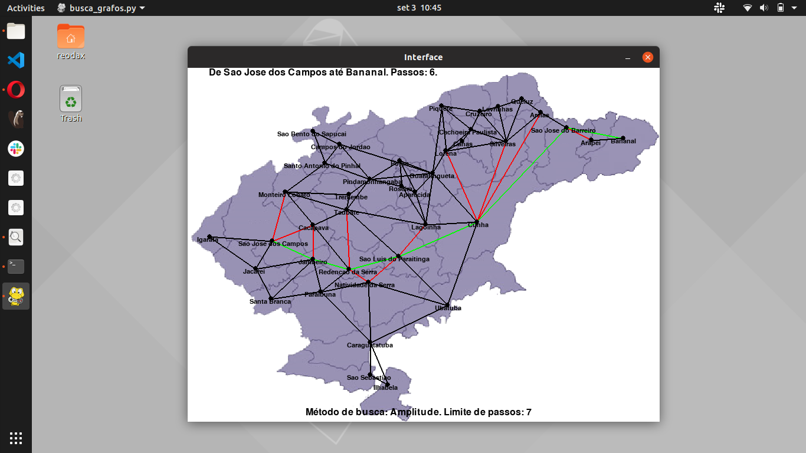
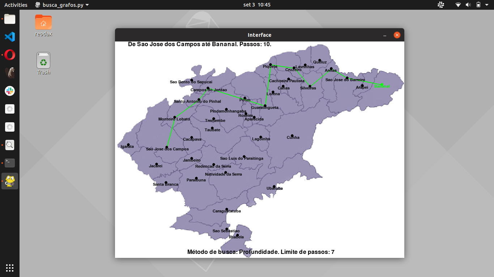
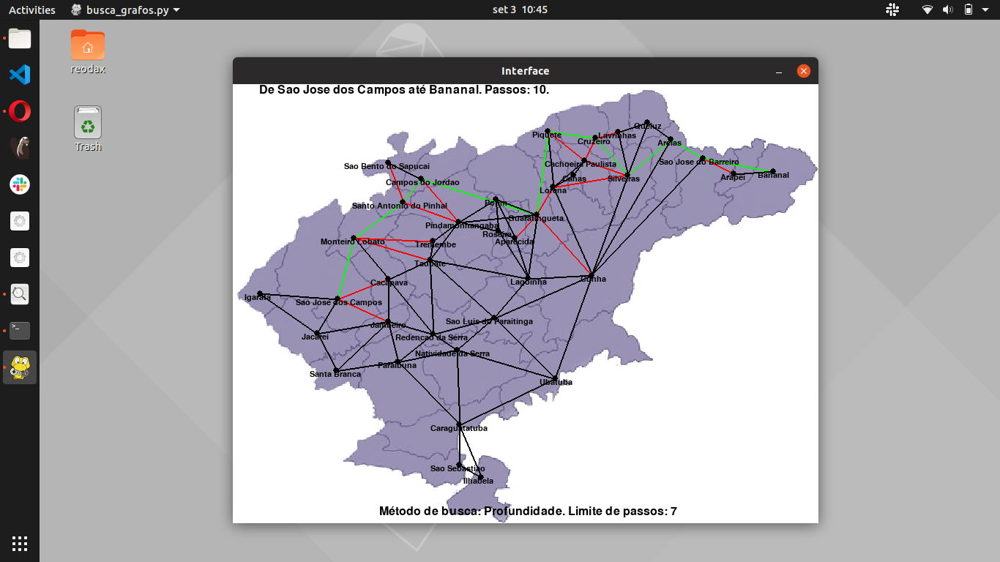
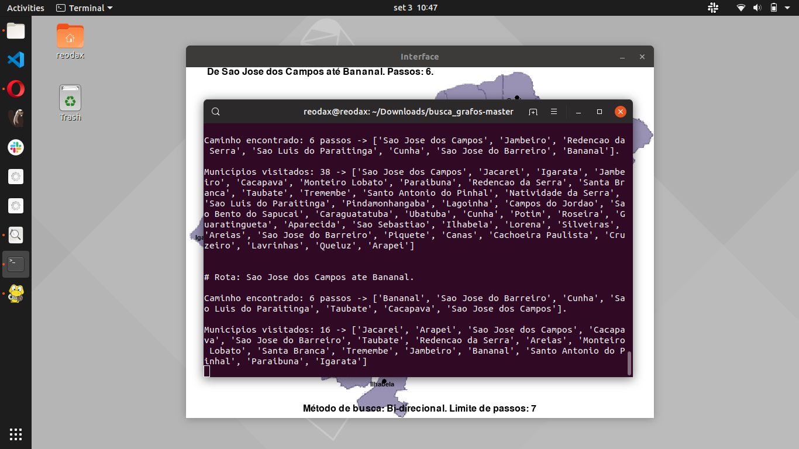

# Busca Vale do Paraíba
Search algorithms applied in a graph that represents the counties of a specific region in the state of São Paulo named "Vale do Paraíba".

Algoritmos de busca aplicados em um grafo que representa os municípios do Vale do Paraíba através de um mapa.

# Métodos de Busca:

* Amplitude;
* Amplitude Bi-direcional;
* Custo Uniforme;
* Profundidade;
* Profundidade Limitada;
* Profundidade Iterativa.

# Search Methods:

* BFS;
* Bi-directional BFS;
* Uniform Cost;
* DFS;
* Limited DFS;
* Iteractive DFS.

# Imagens:

